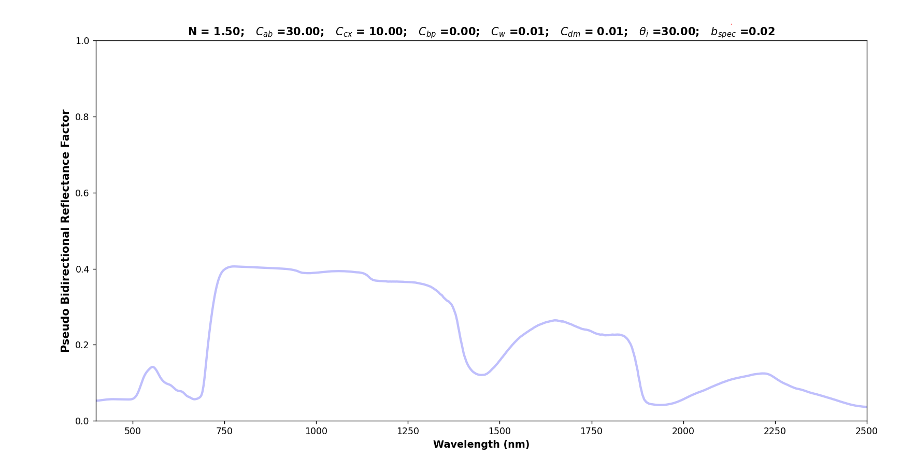
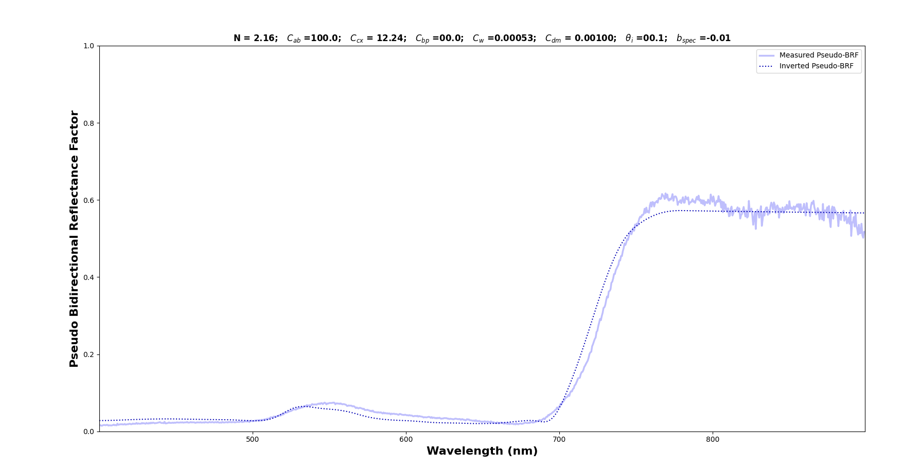

# PyProcosine
## Context
PROCOSINE is a radiative transfer model based on the combination of PROSPECT-D [[_Remote Sens. Environ._ **193**, 204 (2017)]](https://doi.org/10.1016/j.rse.2017.03.004) with COSINE [[_Remote Sens. Environ._ **177**, 220 (2016)]](https://doi.org/10.1016/j.rse.2016.02.029). This model enables to simulate the spectral signatures of plant specimen and to perform inversion algorithms. Both biochemical and structural parameters of leaves can thus be retieved by fitting spectral response with measured spectrum. \
This repository consists of a Python-language version of PROCOSINE adapted from the works of [Paris Diderot University](http://teledetection.ipgp.jussieu.fr/prosail/).  

## Installation  
This work has been developed under conda environment using Python 3.9. Versions of the Python packages can be found in the [requirements file](requirements.txt). In order to avoid issues with Scipy and Numpy packages and disruptions with the python-environment base, we recommend to work in a virtual environment.
- Install [Anaconda](https://www.anaconda.com/download)
- Open Conda command prompt
- Create a virtual environment (Python 3.9)
```
conda create -n procosine_env python==3.9
``` 
- Activate the virtual environment 
```
conda activate procosine_env
``` 
- Define the working directory you want to install PyProcosine in 
```
cd < path_folder_where_pyprocosine_will_be_installed >
``` 
Clone the PyProcosine repository
```
git clone https://gitlab.com/analyse_data/pyprocosine.git
``` 
Change the current working directory and go to the install folder
```
cd pyprocosine/install
``` 
Finally, install the required Python packages
```
pip install -r requirements.txt
``` 
Enjoy!

**Note:** Installation of Numpy package should be done at the same time that the Scipy package in order to have compatible versions.

## Some first tests (examples)

### Simulation of the spectral response using biophysical parameters
First, enter the biophysical parameters of the leaf you want to simulate using this [file](conf/simulation_parameters.json):
- N: leaf structure parameter
- Cab: chlorophyll A and B content [µg/cm²]
- Ccx: carotenoids content [µg/cm²]
- Cbrown: brown pigments content [arbitrary unit]
- Cw: equivalent water thickness [g/cm² or cm]
- Cm: dry matter content [g/cm²]
- Theta_i: light incident angle [°]
- Bspec: specular parameter [unitless]

Then, in order to launch a simulation with the PROCOSINE model go on the app folder and using the script [main_procosine_simu](app/main_procosine_simu.py), type the following command.
```
python main_procosine_simu.py
``` 
You should get a plot where the pseudo bidirectionnal reflectance factor is expressed as a function of the wavelength using the leaf parameters entered before.
<p align="center">

</p>


### Inversion 
Similar to the simulation of spectral response, inversion model can be performed by entering the fields in the file [inversion_parameters](conf/inversion_parameters.json):
- path_spectra: path where the spectral intensities are saved
- path_wl: path where the wavelengths are saved  
- Thetas: incident angle [°]
- P0: initial biophysical parameters
- LB: minimal values of the biophysical parameters used in the inversion model 
- UB: maximal values of the biophysical parameters used in the inversion model
- gtol: tolerance for termination by the norm of the gradient
- xtol: Tolerance for termination by the change of the independent variables
- ftol: Tolerance for termination by the change of the cost function

Then, lauch the inversion model by executing the script [main_inversion_spectrum](app/main_inversion_spectrum.py)
using the following command:
```
python main_inversion_spectrum.py
``` 
Inversion algorithm will then plot the superposition of the measured spectrum and the simulated one. Biophysical parameters are also calculated and displayed in the title part. 
<p align="center">

</p>

## Fundings
This work was in part supported by Région Bretagne and Lannion Trégor Communauté.

## About us
Photonics Bretagne is a French Research and Technology Organisation (RTO) aiming to accelerate the use of photonic innovations applied to the environment, sustainable agriculture, biology and marine resources. In collaboration with institutes (e.g. Arvalis, an applied research institute) and companies, Photonics Bretagne designs and develops photonic devices (TRL 3-7). \
Contact us: biophotonics@photonics-bretagne.com
