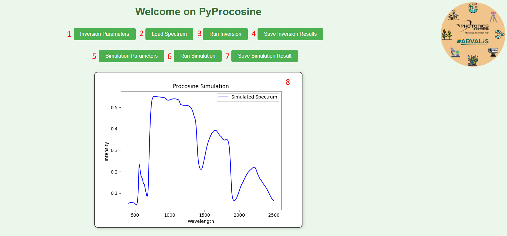
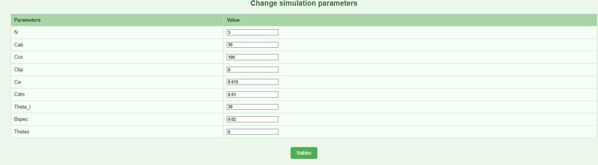
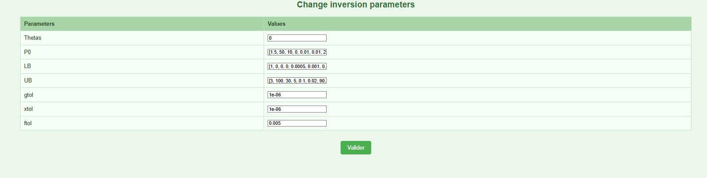

## Procosine Flask Server Wiki

Before using the Flask server, be sure to have successfully passed the installation and prerequisite steps. Every step is available in the [README](https://github.com/Photonics-Bretagne/PyPROCOSINE) of the project.

## Running the Server

Go to the `app/flask_server/` folder and run the [flask_server.py](app/flask_server/flask_server.py):

```bash
cd app/flask_server
python main_procosine_simu.py
```

The Flask server will be available at the IP and port defined in the [flask_server_config.json](conf/flask_server_config.json).  
By default, you can access it in your browser at: [http://127.0.0.1:5000/](http://127.0.0.1:5000/).

## Home Page

<p align="center">
  
</p>

### Push Button Functions

- **1: Inversion Parameters**: Opens a new window with all inversion parameters. See the [Inversion Parameters](#inversion-parameters) section.
- **2: Load Spectrum**: Opens a file selection window to select the spectrum to be inverted with Procosine. The file needs to contain one column for wavelength and a second column for reflectance values. Supported formats: `.txt`, `.csv`, and `.xls`.
- **3: Run Inversion**: When clicked, runs the inversion on the last loaded spectrum and plots the results in the plotting area.
- **4: Save Inversion Results**: Opens a window to select the path where the inversion results will be saved in JSON format. For more details about the JSON file format, see the [Inversion Parameters](#inversion-parameters) section.
- **5: Simulation Parameters**: Opens a new window with all simulation parameters. For more details, see the [Simulation Parameters](#simulation-parameters) section.
- **6: Run Simulation**: Runs the Procosine simulation using the current simulation parameters.
- **7: Save Simulation Result**: Opens a window to select the path where the simulation results will be saved in JSON format.
- **8: Plotting Area**: 
  - If **Run Simulation** is clicked, it will plot the simulated spectrum.
  - If **Run Inversion** is clicked, it will plot the best-fitted spectrum and the loaded spectrum.

## Simulation Parameters

When the **Simulation Parameters (button 5)** is clicked, the following window will appear:

<p align="center">
  
</p>

### Description of Simulation Parameters

- **N**: Leaf structure parameter
- **Cab**: Chlorophyll A and B content [µg/cm²]
- **Ccx**: Carotenoids content [µg/cm²]
- **Cbrown**: Brown pigments content [arbitrary unit]
- **Cw**: Equivalent water thickness [g/cm² or cm]
- **Cm**: Dry matter content [g/cm²]
- **Theta_i**: Light incident angle [°]
- **Bspec**: Specular parameter [unitless]

## Inversion Parameters

When the **Inversion Parameters (button 1)** is clicked, the following window will appear:

<p align="center">
  
</p>

### Description of Inversion Parameters

- **path_spectra**: Path where the spectral intensities are saved
- **path_wl**: Path where the wavelengths are saved  
- **Thetas**: Incident angle [°]
- **P0**: Initial biophysical parameters
- **LB**: Minimum values of the biophysical parameters used in the inversion model 
- **UB**: Maximum values of the biophysical parameters used in the inversion model
- **gtol**: Tolerance for termination by the norm of the gradient
- **xtol**: Tolerance for termination by the change of the independent variables
- **ftol**: Tolerance for termination by the change of the cost function

## Download

You can download this documentation as a file [here](#).
